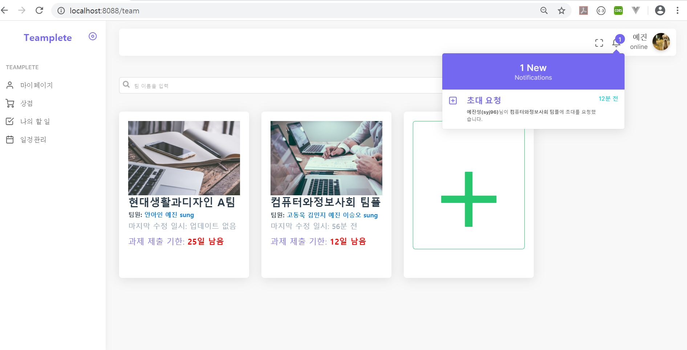
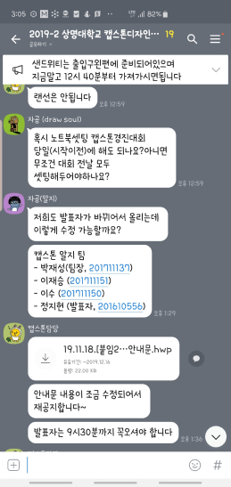
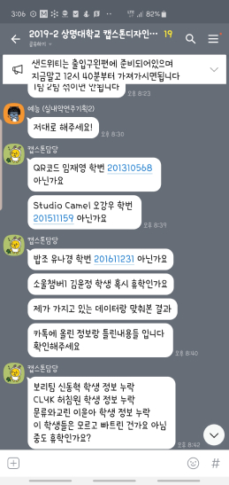
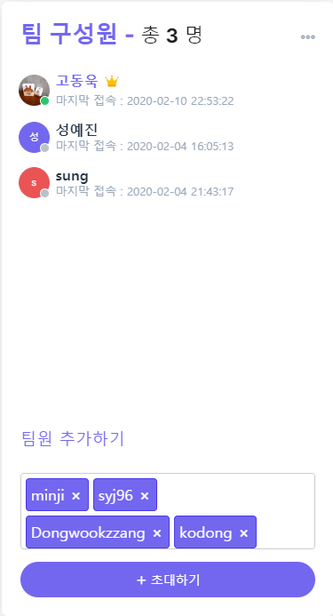
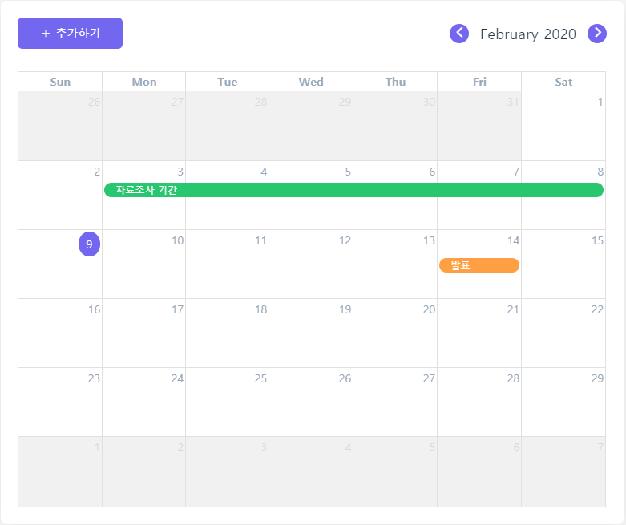
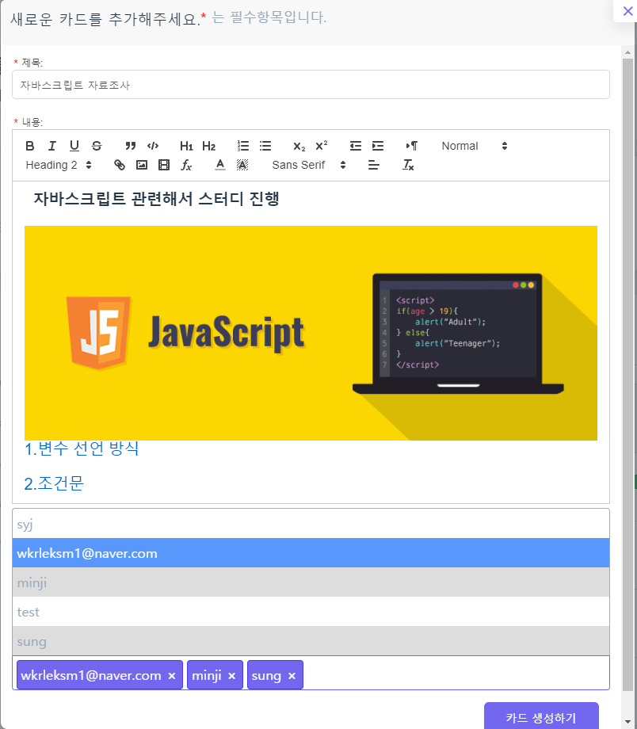

# ****Teamplete에 오신 걸 환영합니다****

**Teamplete**는 조별 과제나 팀 작업 등의 **협업**을 훨씬 더 쉽고 간편하게 만들어주는 웹사이트입니다.

 
 
## 개발동기

여러 인원들에게 **과제**를 내고 검토해야하는 전국 **교수**나 **조교**, **팀장 및 부장**님들!! 

혹은 교양 및 전공수업에서 힘들게 **조별과제**중인 **학생**분들!! 

아직도 불편하게 **단톡방에서 공지**하시고 과제 미제출자를 일일이 추적하시나요? 

  단톡방은 쉽게 공지가 가능하지만 그만큼 **가독성이 떨어지고**, 과제에 대한 질문이 올라오면 핵심 내용은 묻혀서 찾기도 어렵죠.

 게다가 참고할 파일은 어떤 건지,  이 과제의 담당자는 누군지, 마감 기한은 언제까지인지, 현재까지 누가 제출했고 제출하지 않았는지 파악하기도 어렵죠. 그럼 어떻게 될까요??

네! 공지사항을 다들 제대로 이해하지 못해 **과제를 다시 제출하거나 제출하지 않는 상황**이 일어나게 됩니다. (ㅠㅠ) 게다가 단톡방에서는 각 개개인의 산출물을 관리하기도 어렵습니다.  

**Teamplete는** 이러한 불편함을 해소하고자 **고동욱** 및 **성예진** 2인의 개발자가 만든 Spring MVC 기반 Web Project입니다.

## 개발환경

**운영체제 :** Windows 10

**서버 :**  Apache Tomcat 9.0 server

**IDE :** Eclipse

**Database:** Oracle SQL Developer, Oracle XE 11g

**Lang/Tools :** Java, Servlet, JSP, Javascript, HTML, CSS

**Web Hosting :** AWS Route53, RDS, EC2

**사용 기술** :  Ajax, JQuery, Spring Framework, Bootstrap, MyBatis, WebSocket

**Javascript Framework** : Select2js, Fullcalendar, NanoSlider, Sweet Alert,  Quill Editor, SockJS

Select2Js : Multiple Select Input

Fullcalendar : 일정 관리 가능한 달력

SweetAlert : 기본 Alert창을 더 심미적으로

Quill Editor : 강력한 Rich Text Editor

SockJS : Websocket을 활용한 팀 채팅

**Performance Improvement** :  IntersectionObserver을 활용한 동적 로딩 활용.

**결제 모듈** : IAMPort API를 활용한 PG사 결제 지원(카카오페이). User 등급에 따라 권한 차등 부여.

**보안 관련** : SQL Injection Attack을 막기 위한 설계를 함.
