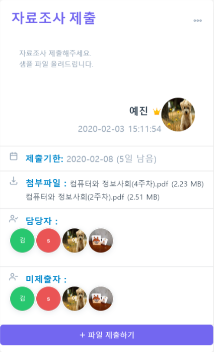
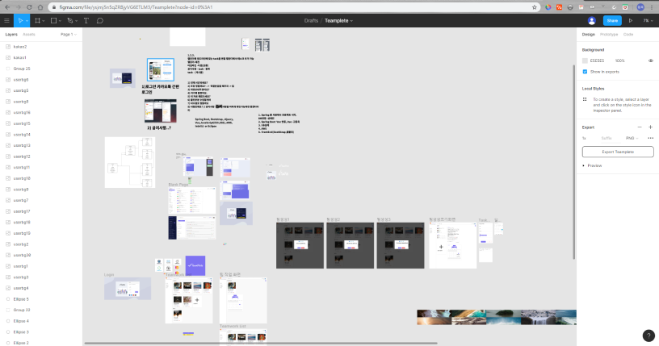
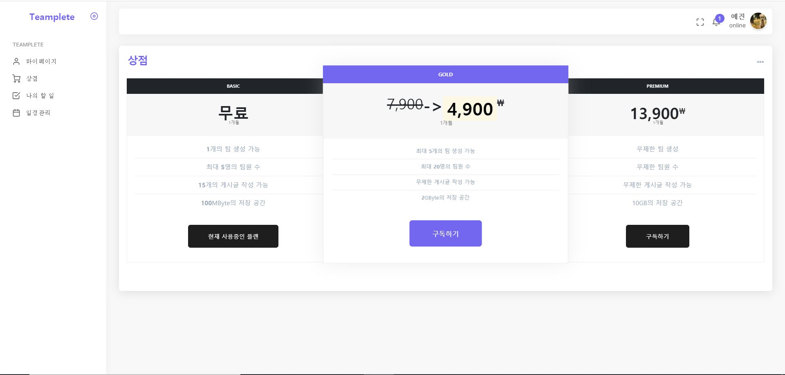
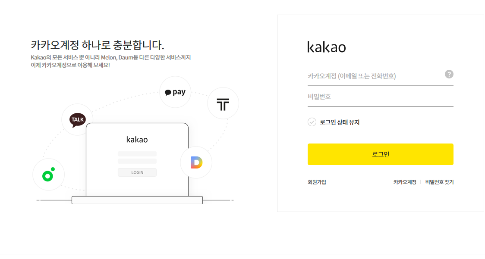
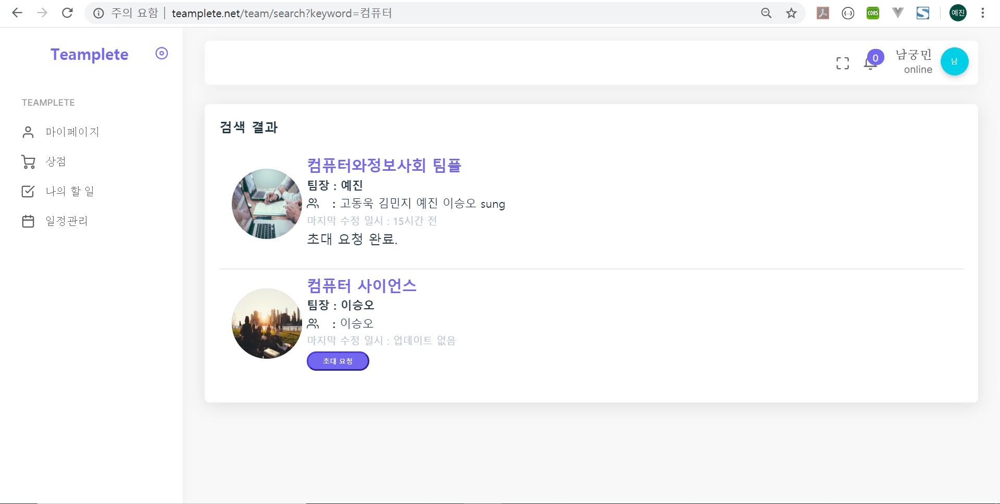
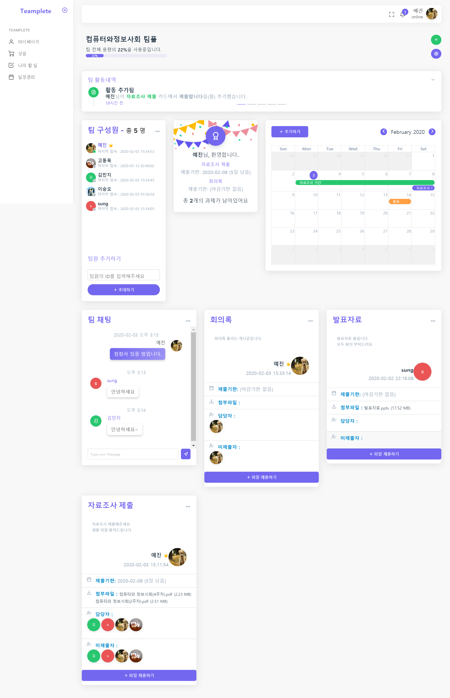
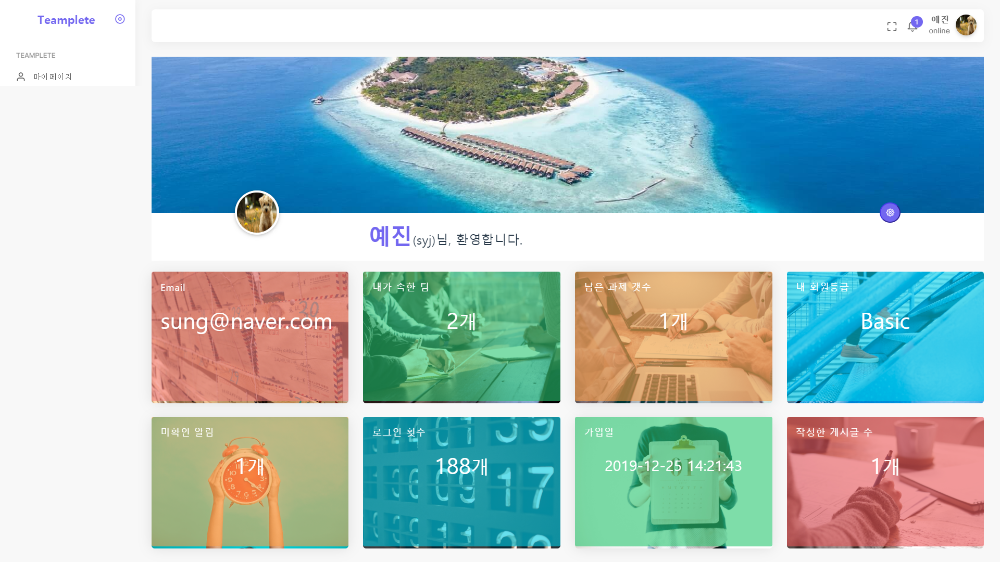
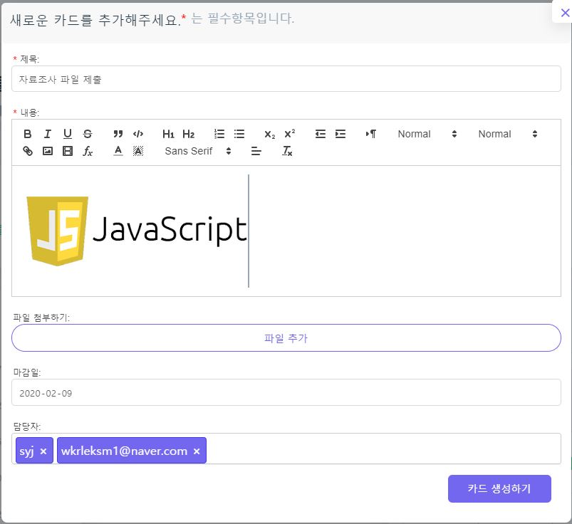

# ****Teamplete에 오신 걸 환영합니다****

[Teamplete](http://www.teamplete.net)는 조별 과제나 팀 작업 등의 **협업**을 훨씬 더 간편하게 만들어주는 반응형(Responsive) 웹사이트입니다.

 
 
 
  
 
## 개발동기

여러 인원들에게 **과제**를 내고 검토해야하는 전국 **교수**나 **조교**, **팀장 및 부장**님들!! 

혹은 교양 및 전공수업에서 힘들게 **조별과제**중인 **학생**분들!! 

아직도 불편하게 **단톡방에서 공지**하시고 과제 미제출자를 일일이 추적하시나요? 

  단톡방은 쉽게 공지가 가능하지만 그만큼 **가독성이 떨어지고**, 과제에 대한 질문이 올라오면 핵심 내용은 묻혀서 찾기도 어렵죠.

 게다가 참고할 파일은 어떤 건지,  이 과제의 담당자는 누군지, 마감 기한은 언제까지인지, 현재까지 누가 제출했고 제출하지 않았는지 파악하기도 어렵죠. 그럼 어떻게 될까요??

네! 공지사항을 다들 제대로 이해하지 못해 **과제를 다시 제출하거나 제출하지 않는 상황**이 일어나게 됩니다. (ㅠㅠ) 게다가 단톡방에서는 각 개개인의 산출물을 관리하기도 어렵습니다. 

이러한 답답한 상황을 해결하기 위해 직접 개발에 나섰습니다. 이제 이렇게 공지하세요!!

어떤가요?? 훨씬 깔끔해졌죠?

Teamplete에서 **간단하게 카드를 추가**하기만 하면 제출기한은 언제까지인지, 참고할 파일은 무엇인지 **직관적**으로 한 눈에 볼 수 있습니다.

또한, 더 이상 공지 읽고 제출은 다른 곳에 할 필요가 없습니다. 명단을 만들어 누가 제출했는지 안 했는지 확인하는 것도 참 번거로웠죠??

이제 **Teamplete**에서 편리하게 팀 작업을 트래킹하고 산출물들을 관리하세요!!

## 핵심 기능

**카카오톡 간편 로그인 지원**

**팀 일정관리를 위한 강력한 calendar기능**

**실시간 팀 채팅 기능**

**사진 및 파일 첨부한 게시글 작성 및 팀 내 과제 업로드 및 다운로드 기능**

**팀 내 과제 제출자 및 미제출자 확인 가능**(이제 무임승차는 그만!)

**과제 담당자 지정 기능**

****

## 개발환경

[Teamplete](http://www.teamplete.net)는 **고동욱** 및 **성예진** 2인의 개발자가 만든 Spring MVC 기반 Web Project입니다.

바로가기 : [www.teamplete.net](http://www.teamplete.net)

**운영체제 :** Windows 10

**서버 :**  Apache Tomcat 9.0 server

**IDE :** Eclipse

**Database:** Oracle SQL Developer, Oracle XE 11g

**Lang/Tools :** Java, Servlet, JSP, JSTL, Javascript, HTML, CSS

**UI/Prototype :** Figma 

[Figma 링크 바로가기](https://www.figma.com/file/ysjmj5n5qZRBjyVG6ETLM3/Teamplete?node-id=0%3A1)

설계부터 UI Design 등의 많은 화면 기술 작업을 figma 툴을 사용해 진행하였습니다. 

**Web Hosting :** AWS Route53, RDS, EC2

www.teamplete.net Domain을 사용하기 위해 Route53을 연결했고,

EC2 (서버 컴퓨터)는 ubuntu 16.0.4, RDS는 Oracle을 사용합니다.

사용자 시간에 맞게 동작하도록 EC2 및 RDS Timezone 설정을 완료하였습니다.

**사용 기술** :  Ajax, JQuery, Spring Framework, Bootstrap, MyBatis, WebSocket, HandShakeInterceptor

**Javascript 기술** : Select2js, Fullcalendar, NanoSlider, Sweet Alert,  Quill Editor, SockJS

**Select2Js** : 한 번에 여러 명을 초대하거나 여러 사람을 담당자로 지정할 때 필요합니다.

**Fullcalendar** : 일정 관리 가능한 달력을 보여주기 위해 사용하였습니다. 마감일까지 남은 과제들을 보여줍니다.

**SweetAlert** : 기본 Alert창을 더 심미적으로, 기능적으로 활용할 수 있게 하기 위해 사용하였습니다.

**Quill Editor** : Text 뿐만 아니라 사진, 링크, 폰트 크기 및 색까지 변경할 수 있도록 하기 위해 사용하였습니다.

**SockJS** : Websocket을 활용한 팀 채팅에 사용되었으며, HandShakeInterceptor 및 WebSocketHandler와 같이 사용합니다.

WebSocket을 사용하였기 때문에 팀 내 채팅은 새로고침 없이 실시간(Real-time)으로 동작합니다.

**Performance Improvement** :  IntersectionObserver을 활용한 동적 로딩 활용에 사용하였습니다. Quill-Editor를 로딩할 때도 사용됩니다.

(현재 보고 있는 화면만 이미지 로딩, 스크롤 시 추가적으로 로딩)

**결제 모듈** : IAMPort API를 활용한 PG사 결제 지원(카카오페이). User 등급에 따라 권한을 차등하게 부여하였습니다.

**보안 관련** : SQL Injection Attack을 막기 위한 설계를 하였고,

파일 업로드 및 다운로드와 관련 있는 Amazon S3 Key를 따로 관리하였습니다.

또한 회원가입 시 특수문자 및 비밀번호의 조건을 검사하는 알고리즘을 추가하였습니다.

**편의성 관련** : og-property 속성을 주어서 모바일에서 확인할 때 편의성을 증대하였습니다.

예시 :)

모바일에서 웹 주소를 공유하는 일이 잦다는 점에 착안하여 미리보기 이미지 및 설명, 속성을 추가하였습니다.

간편 로그인 : KaKao-api를 활용하여 기존 카카오톡 계정으로 [Teamplete](http://www.teamplete.net)에 로그인 할 수 있습니다.

팀 검색 기능 : 가입하고 싶은 팀을 검색해서 가입 요청을 보내고, 팀장이 수락하면 팀에 합류할 수 있습니다.

## 스크린샷

팀 기본 화면 :

마이페이지 화면:

카드 작성(일정, 과제 추가 화면):

## Contributor

**201411164([고동욱](https://github.com/201411164))**

**sungyejin([성예진](https://github.com/sungyejin))**

 

## License

2020 [Teamplete](http://www.teamplete.net).Co All rights reserved. 

